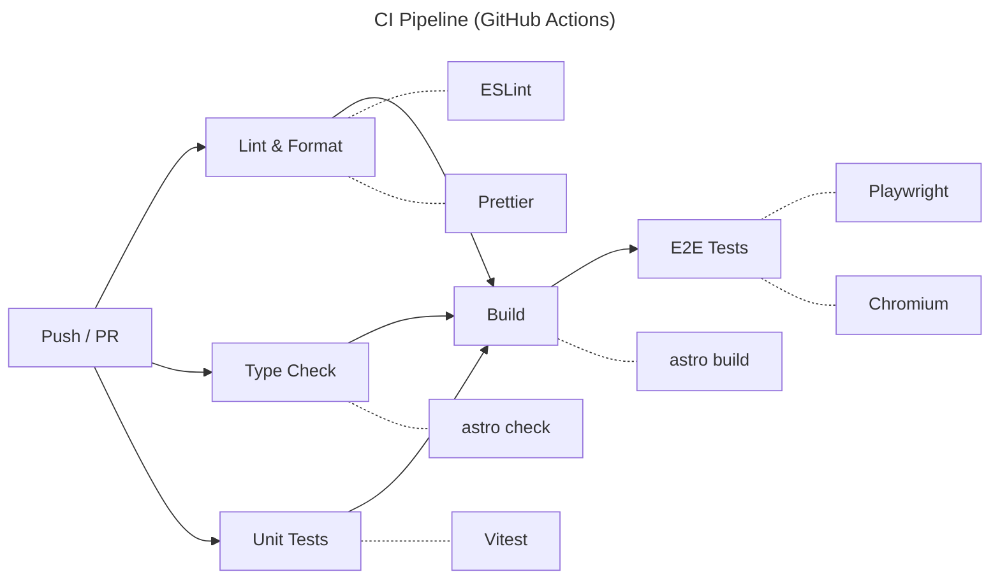
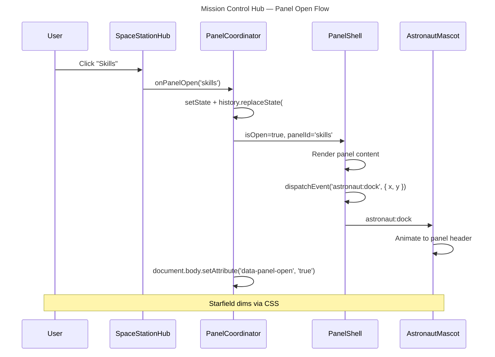
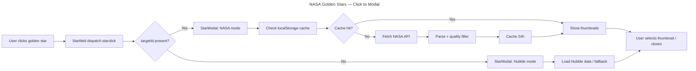
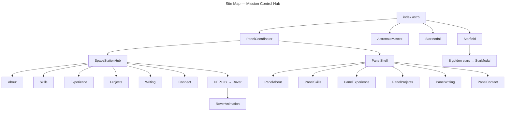
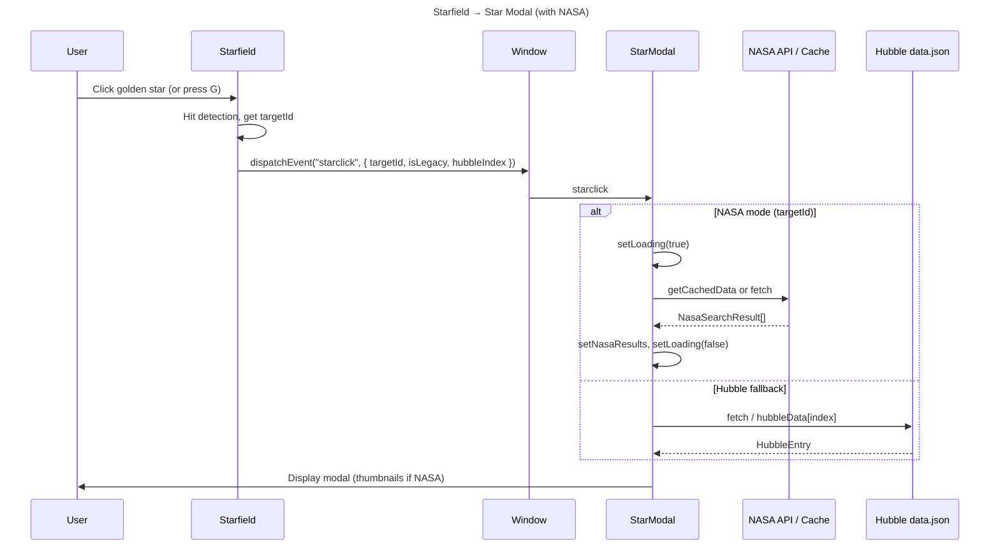

# Ishan Jain Portfolio — Project Summary & Development Documentation

**Last Updated:** 2026-02-10  
**Status:** Production-ready  
**Framework:** Astro 5.x + React 19 islands

---

## Table of Contents

1. [Project Overview](#1-project-overview)
2. [Project Structure](#2-project-structure)
3. [Architecture Decision Records (ADR)](#3-architecture-decision-records-adr)
4. [Flow Charts & Diagrams](#4-flow-charts--diagrams)
5. [Complete Development Documentation](#5-complete-development-documentation)
6. [References](#6-references)

---

## 1. Project Overview

### Purpose

Production-ready, animated portfolio for **Ishan Jain** (Sydney, AU) with an **astronomy/space station theme**. The site presents a backend-leaning full-stack engineer profile with fintech risk/fraud experience, built as a single-page experience with an interactive **Mission Control Space Station Hub**.

### Tech Stack

| Layer | Choice | Rationale |
|-------|--------|-----------|
| **Framework** | Astro 5.x (static) | Static-first, islands architecture |
| **Styling** | TailwindCSS v4 (`@theme`) | CSS variables, no config file |
| **Interactive** | React 19 islands | Hydrated on demand (client:load / client:idle / client:visible) |
| **Animation** | CSS + Motion (React) | Lightweight; Motion only where needed |
| **Testing** | Vitest + RTL + Playwright | Unit + E2E + accessibility |
| **Lint/Format** | ESLint (flat) + Prettier | Modern config |
| **CI** | GitHub Actions | Lint → Typecheck → Unit → Build → E2E |
| **Deploy** | Netlify (static) | Auto-deploy from `main` |
| **Types** | TypeScript strict | Via `astro/tsconfigs/strict` |

### Key Features

- **Mission Control Hub**: Central space station with 7 controls (About, Skills, Experience, Projects, Writing, Connect, DEPLOY).
- **Panel system**: Hash routing (`#skills`, `#experience`, etc.), focus trap, ESC/backdrop close, astronaut docking.
- **Starfield**: Canvas particle system with parallax and twinkling; 8 **golden stars** open NASA imagery modal.
- **NASA Golden Stars**: Daily weighted random targets, NASA Image & Video Library API, multi-image thumbnails, keyboard shortcut **G**.
- **Astronaut Mascot**: Floats on hub; docks to panel header when a panel opens.
- **Rover Animation**: DEPLOY button triggers rover traveling to Earth, plants flag “Thanks for visiting!”
- **Hubble fallback**: Local Hubble dataset and optional NASA API; quality filtering and 24h cache.
- **Accessibility**: WCAG 2.1 AA, skip link, focus trap, reduced motion, keyboard nav.

---

## 2. Project Structure

### Directory Tree

```
ishanjain_portfolio/
├── .github/
│   └── workflows/
│       └── ci.yml                 # Lint → Typecheck → Unit → Build → E2E
├── docs/
│   ├── PROJECT-SUMMARY.md         # This document
│   ├── ADR-001-mission-control-hub-transformation.md
│   ├── architecture.md
│   ├── implementation_plan.md
│   ├── PHASE2-IMPLEMENTATION-SUMMARY.md
│   ├── PHASE3-NASA-GOLDEN-STARS.md
│   ├── ANIMATION-CONFIG-REFERENCE.md
│   └── diagrams/
│       ├── ci-pipeline.mmd
│       ├── component-flow.mmd
│       └── sitemap.mmd
├── public/
│   ├── favicon.svg
│   ├── og-image.png
│   ├── resume.pdf
│   ├── fonts/
│   │   ├── inter-var.woff2
│   │   └── space-grotesk-var.woff2
│   └── hubble/
│       ├── data.json              # Curated Hubble entries
│       └── images/                # WebP images (~50KB each)
├── src/
│   ├── components/
│   │   ├── layout/
│   │   │   ├── Header.astro       # Fixed nav, smooth scroll
│   │   │   ├── Footer.astro       # Earth SVG, RoverAnimation
│   │   │   └── SkipLink.astro     # Skip to main (a11y)
│   │   ├── sections/              # Astro content sections (legacy/reference)
│   │   │   ├── Hero.astro, Credibility.astro, Experience.astro, etc.
│   │   ├── islands/               # React islands (hydrated)
│   │   │   ├── SpaceStationHub.tsx   # Hub controls, DEPLOY
│   │   │   ├── PanelCoordinator.tsx  # Hash routing, panel state
│   │   │   ├── PanelShell.tsx        # Modal overlay, focus trap
│   │   │   ├── PanelAbout.tsx        # (used via coordinator)
│   │   │   ├── AstronautMascot.tsx   # Float + dock to panel
│   │   │   ├── Starfield.tsx         # Canvas stars, golden stars
│   │   │   ├── StarModal.tsx         # NASA/Hubble modal
│   │   │   ├── RoverAnimation.tsx    # DEPLOY rover
│   │   │   └── MissionControl.tsx     # Footer quick links
│   │   ├── panels/                 # Panel content (React)
│   │   │   ├── PanelAbout.tsx, PanelSkills.tsx, PanelExperience.tsx
│   │   │   ├── PanelProjects.tsx, PanelWriting.tsx, PanelContact.tsx
│   │   └── ui/
│   │       ├── Badge.astro, Card.astro, SectionHeading.astro, TimelineItem.astro
│   ├── content/
│   │   ├── experience.ts, achievements.ts, projects.ts, skills.ts
│   │   └── nasaTargets.ts          # 24 NASA targets, weighted selection
│   ├── layouts/
│   │   └── BaseLayout.astro       # HTML shell, meta, fonts, global CSS
│   ├── pages/
│   │   ├── index.astro            # Renders PanelCoordinator + Starfield + Modal
│   │   └── robots.txt.ts
│   ├── styles/
│   │   ├── global.css             # Tailwind + @theme tokens
│   │   └── panels.css             # Panel-specific styles
│   ├── types/
│   │   ├── index.ts               # Experience, PanelId, HubControl, etc.
│   │   └── nasa.ts                # NasaTarget, NasaSearchResult, cache
│   └── utils/
│       ├── announce.ts            # Screen reader announcements
│       ├── hubble.ts               # Local Hubble data loader
│       └── nasa.ts                # NASA API client, cache, quality filter
├── tests/
│   ├── unit/
│   │   ├── StarModal.test.tsx, MissionControl.test.tsx
│   │   ├── hubble-utils.test.ts, nasa-quality-filter.test.ts
│   │   └── setup.ts
│   └── e2e/
│       ├── navigation.spec.ts, accessibility.spec.ts
│       ├── star-interaction.spec.ts, golden-stars.spec.ts
│       └── fixtures/
│           └── nasa-response.json
├── astro.config.mjs
├── tsconfig.json
├── vitest.config.ts
├── playwright.config.ts
├── package.json
├── netlify.toml
├── .prettierrc, .prettierignore
├── eslint.config.js
└── README.md
```

### Component Boundaries

| Layer | Rendering | JS Shipped | Purpose |
|-------|-----------|------------|---------|
| `sections/` | Server (Astro) | None | Static content (reference) |
| `ui/` | Server (Astro) | None | Reusable primitives |
| `layout/` | Server (Astro) | Minimal | Page shell |
| `islands/` | Client (React) | Per-island bundle | Hub, panels, starfield, modal, rover |
| `panels/` | Client (React) | Via PanelCoordinator | Panel content |

---

## 3. Architecture Decision Records (ADR)

### ADR-001: Mission Control Space Station Hub Transformation

**Status:** Implemented  
**Date:** 2026-02-10  
**Full doc:** [docs/ADR-001-mission-control-hub-transformation.md](ADR-001-mission-control-hub-transformation.md)

#### Context

The portfolio was a single-page scroll with 8 sections. The goal was to turn it into an interactive **Mission Control Space Station Hub**: central hub, overlay panels (DockedModule aesthetic), persistent starfield, astronaut docking, and DEPLOY rover, while keeping WCAG 2.1 AA and reusing content.

#### Decisions

1. **Panel-based navigation**
   - **SpaceStationHub**: 7 controls (About, Skills, Experience, Projects, Writing, Connect, DEPLOY).
   - **PanelCoordinator**: Single source of truth; hash routing (`#skills`, etc.); `data-panel-open` on body.
   - **PanelShell**: Reusable modal, focus trap, ESC/backdrop close, Motion animations, reduced-motion fallback.

2. **URL hash routing**
   - No SPA router: `#skills` opens Skills panel; back/forward and deep links work.
   - Valid panels: `about`, `skills`, `experience`, `projects`, `writing`, `contact`.

3. **Event-driven state**
   - No React Context: hub and PanelShell are siblings; hash is source of truth.
   - Custom events: `astronaut:dock`, `astronaut:return`, `rover:deploy`, `starclick`.

4. **Content in React panels**
   - Panel content is React (`PanelAbout`, `PanelSkills`, etc.) importing `src/content/*.ts` to avoid Astro/React boundary issues and keep one content source.

5. **Animations**
   - Motion (Framer Motion fork): panel slide, backdrop fade, rover/flag.
   - All respect `prefers-reduced-motion` (fade/teleport where appropriate).

6. **Accessibility**
   - Hub: full keyboard (Tab, arrows, Enter/Space).
   - Panel: focus trap, restoration on close, `aria-modal`, live region announcements.

#### Consequences

- **Positive:** Immersive UX, deep links, lazy panel content, clear component boundaries.
- **Negative:** More components and state; panel markup lives in React; larger JS surface (mitigated by code splitting).

---

## 4. Flow Charts & Diagrams

### 4.1 CI Pipeline



### 4.2 Mission Control Hub & Panel Flow



### 4.3 NASA Golden Stars (Star Click → Modal)



### 4.4 Site Map (Current Structure)



### 4.5 Starfield → StarModal (Original + NASA)



---

## 5. Complete Development Documentation

### 5.1 Local Setup

```bash
git clone <repo>
cd ishanjain_portfolio
npm install
npm run dev          # http://localhost:4321
```

**First-time E2E:** `npx playwright install chromium`

### 5.2 Scripts

| Command | Description |
|---------|-------------|
| `npm run dev` | Dev server (Astro) |
| `npm run build` | Production build → `dist/` |
| `npm run preview` | Serve `dist/` locally |
| `npm run check` | Astro type check |
| `npm run lint` | ESLint + Prettier check |
| `npm run lint:fix` | Fix lint and format |
| `npm run format` | Prettier write |
| `npm run test` | Unit tests (Vitest) |
| `npm run test:watch` | Vitest watch |
| `npm run test:e2e` | Playwright E2E |
| `npm run test:e2e:ui` | Playwright UI mode |

### 5.3 Environment Variables

| Variable | Required | Description |
|----------|----------|-------------|
| `PUBLIC_NASA_API_KEY` | No | NASA API key (optional; NASA Image Library used for golden stars) |

### 5.4 Theme Tokens (global.css)

- **Royal Blue** (50–900): primary brand
- **Gold** (300–600): highlights, golden stars
- **Pine Green** (400–600): secondary
- **Surface:** `#0a0e27`, elevated `#111638`
- **Text:** primary, muted, dim

### 5.5 Implementation Phases (Summary)

| Phase | Summary | Docs |
|-------|---------|------|
| **1** | PanelCoordinator, PanelShell, hash routing, index.astro wiring | ADR-001, implementation_plan |
| **2** | SpaceStationHub, panel content (PanelAbout, etc.), styles | ADR-001 |
| **3** | Panel content from content/*, panels.css | implementation_plan |
| **4** | Panel motion, starfield dimming, body scroll lock | ADR-001 |
| **5** | Astronaut docking, Footer Earth redesign, RoverAnimation | PHASE2-IMPLEMENTATION-SUMMARY |
| **6** | NASA Golden Stars: 8 stars, nasaTargets, NASA API, cache, thumbnails | PHASE3-NASA-GOLDEN-STARS |
| **7** | Quality filter, “Today’s Discovery” badge, keyboard **G**, tests | PHASE3-NASA-GOLDEN-STARS (Phase 4) |

### 5.6 Testing

- **Unit (Vitest + RTL):** StarModal, MissionControl, hubble utils, NASA quality filter.
- **E2E (Playwright):** navigation, star interaction, golden stars (hint, **G** key, modal), accessibility (axe-core).
- **Run E2E:** `npm run build && npm run test:e2e` (or start preview and run Playwright).

### 5.7 Deployment

- **Netlify:** `netlify.toml` — build `npm run build`, publish `dist/`, Node 20.
- Push to `main` triggers deploy; CI must pass (lint, typecheck, unit, build, E2E).

### 5.8 Accessibility

- Skip link, landmarks, focus trap in modals/panels, `aria-label` / `aria-expanded` where needed.
- `prefers-reduced-motion`: no parallax/travel where inappropriate; fade/teleport alternatives.
- WCAG 2.1 AA contrast; no automated a11y violations in E2E.

### 5.9 Key Files Reference

| Concern | File(s) |
|--------|--------|
| Entry point | `src/pages/index.astro` |
| Hub + panels | `PanelCoordinator.tsx`, `SpaceStationHub.tsx`, `PanelShell.tsx` |
| Panel content | `src/components/panels/*.tsx` |
| Golden stars | `Starfield.tsx`, `StarModal.tsx`, `nasaTargets.ts`, `utils/nasa.ts` |
| Types | `src/types/index.ts`, `src/types/nasa.ts` |
| Theme | `src/styles/global.css` |
| Animation config | [ANIMATION-CONFIG-REFERENCE.md](ANIMATION-CONFIG-REFERENCE.md) |

---

## 6. References

- [Astro Islands](https://docs.astro.build/en/concepts/islands/)
- [WCAG 2.1](https://www.w3.org/WAI/WCAG21/quickref/)
- [Motion (motion.dev)](https://motion.dev)
- [NASA Image and Video Library API](https://images.nasa.gov/docs/images/api.html)
- In-repo: [docs/architecture.md](architecture.md), [README.md](../README.md)
